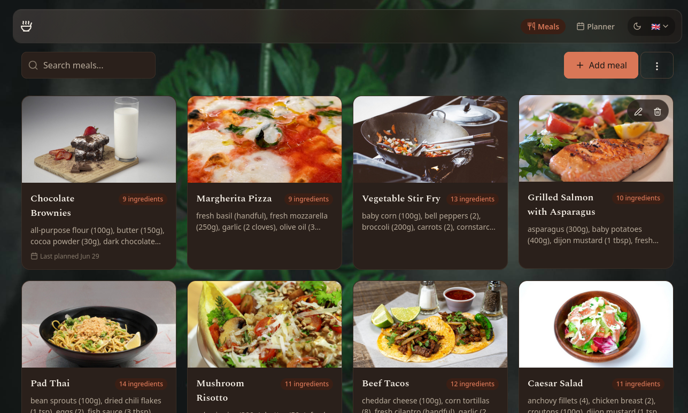

<p align="center">
  
</p>

<p align="center">
  <a href="https://github.com/RouHim/mealme/releases/latest"></a>
  <a href="https://github.com/RouHim/mealme/actions/workflows/ci.yml"></a>
</p>

<p align="center">
  
</p>

**MealMe** is a personal meal manager that runs entirely on your computer — no cloud, no accounts, no subscriptions. Add meals, search your collection, plan your week, and import recipes from the web or from photos using AI.

## What you can do

- **Manage your meals** — add, edit, search, and delete. Each meal has a name, ingredients with quantities, optional image, and creation/update times.
- **Cooking view** — open a meal to see ingredients and instructions rendered for cooking. HTML instructions are sanitised and rendered as formatted paragraphs; plain text preserves newlines.
- **Plan your week** — generate a weekly meal plan from your collection. Plans aggregate ingredients and sum numeric quantities so you know what to shop for.
- **Import recipes** — paste a URL, drop raw HTML/JSON-LD, or let an LLM parse a photo or text description. Imported recipes land in a review form before saving.
- **Bulk import** — paste a list of recipe URLs at once; each is fetched and parsed, with successes and failures summarised.
- **Add meal images** — paste from clipboard, load from a URL, or drop a file. Non-image files are rejected inline; oversized PNGs are downscaled to JPEG.
- **Shopping list sync** — send planned ingredients to your Bring! shopping list.
- **Export and back up** — export your collection as a `.zip` and re-import it on another machine.
- **Run anywhere** — single binary, no dependencies. Data lives in a SQLite file on disk; you control it.
- **Light and dark themes** — follows your system preference, with a manual toggle that remembers your choice.
- **Multiple languages** — the UI is available in English and German, with a language switcher that accepts system, English, or German.

## Getting started

### Download a pre-built binary

Grab the latest release for your platform from the [Releases page](https://github.com/RouHim/mealme/releases/latest):

```bash
# Linux / macOS (x86_64)
curl -L -o mealme https://github.com/RouHim/mealme/releases/latest/download/mealme-x86_64-unknown-linux-musl
chmod +x mealme
./mealme

# Linux / macOS (arm64 / Apple Silicon)
curl -L -o mealme https://github.com/RouHim/mealme/releases/latest/download/mealme-aarch64-unknown-linux-musl
chmod +x mealme
./mealme
```

Then open **http://127.0.0.1:11341** in your browser.

### Build from source

Requires [Rust](https://rustup.rs) 1.85+ and [Node.js](https://nodejs.org) 26+ (build-time only — not needed to run).

```bash
git clone https://github.com/RouHim/mealme.git
cd mealme
cargo run --release
```

## Using MealMe

### Meals

The home screen shows your meal collection, newest first. Use the search bar to filter by name or ingredient. Click a meal to edit it, or use the delete button to remove it.

When adding or editing a meal, each ingredient goes on its own line with an optional quantity:

```
200g pasta
2 eggs
salt to taste
```

Quantity text (e.g. `200g`, `2 cups`, `a pinch`) is preserved and used by the planner to sum up your shopping list.

### Cooking view

Click any meal to open its cooking view at `/meals/{id}`. You'll see the full ingredient list and instructions rendered for cooking. HTML instructions are sanitised and displayed as formatted paragraphs; plain text preserves newlines. Use the **Polish instructions** action to have an LLM rewrite rough steps into clean numbered steps before saving.

### Meal images

Add images to your meals three ways: paste from clipboard, load from a URL, or drop a file onto the image upload area. Non-image files are rejected with an inline error message. Oversized PNGs are automatically downscaled to JPEG (max 3840×2160). Meals without images show no image element — only meals with images display a thumbnail.

### Weekly planner

Switch to the **Planner** tab to generate a weekly meal plan. Pick a week, choose how many meals you want, and the planner randomly selects them from your collection. You can swap individual meals or regenerate the whole plan.

The ingredient summary merges identical ingredients across all planned meals and sums numeric quantities — ready for your shopping list.

### Recipe import

**From URL** — paste a link to any recipe website. MealMe fetches the page and extracts the recipe automatically.

**From paste** — drop in raw HTML or JSON-LD markup if you already have the source.

**From photo or text (AI)** — attach a photo of a dish or recipe card, optionally add a text hint, and a vision-capable LLM parses it into a structured recipe. This requires an API key from a supported provider (see [Configuration](#configuration)).

#### Using AI recipe import

1. Select your provider from the dropdown — only providers with a configured API key are selectable.
2. Choose a model from the list fetched live from the provider's API.
3. Either describe the dish in text, attach a photo, or both.
4. Vision-capable models (e.g., `gpt-4o-mini`, `gemini-2.5-flash`, `llama3.2-vision`) are needed for photo input.
5. The extracted recipe appears in the review form — edit before saving.

#### Custom OpenAI-compatible endpoints

Select "Custom OpenAI-compatible" as the provider to use any server with an OpenAI-compatible API — vLLM, LocalAI, LiteLLM router, LM Studio, text-generation-webui, or any server exposing `/v1/models` and `/v1/chat/completions`.

1. Enter the base URL (e.g., `http://localhost:8080/v1/` for LM Studio, `http://localhost:4000/v1/` for LiteLLM router).
2. Optionally enter an API key if your server requires authentication.
3. Models are fetched live from the server's `/v1/models` endpoint.

#### Bulk URL import

Paste a list of recipe URLs (one per line) to import multiple recipes at once. Each URL is fetched and parsed automatically. The result shows which imports succeeded and which failed, so you can retry or skip problematic URLs. The meal list reloads automatically on success.

#### Troubleshooting AI import

- **"No providers available"** — set an API key env var (e.g., `OPENAI_API_KEY`) or start a local Ollama server.
- **"API key not configured"** — the env var was empty when the server started; restart after setting it.
- **"Could not load models"** — check API key validity and network connection; for Ollama, ensure `ollama serve` is running on port 11434.
- **"Request timed out"** — use a faster model, check your network, or try a local model.
- **"Could not extract a recipe"** — use a clearer photo or a more descriptive text hint.

### Export and backup

Export your entire meal collection as a `.zip` file and re-import it on another machine via the same endpoint. Useful for moving between computers or taking a snapshot before making bulk changes.

### Appearance and language

Click the **Theme** button to cycle through system → light → dark → system. Your choice is saved to `localStorage` as `mealme-theme`. Click the **Language** button to switch between System, English, or Deutsch (stored as `mealme-locale`). The UI updates immediately.

### Bring! shopping list

After generating a weekly plan, send ingredients to your [Bring!](https://getbring.com) shopping list. Each ingredient in the plan summary gets a one-click **Send to Bring!** button. You'll need a Bring! account — if you signed up with Google, Apple, or Facebook, set a password first via the Bring! app or website settings.

## Configuration

| Variable | What it does | Default |
|----------|--------------|---------|
| `MEALME_DATA_DIR` | Where the database file lives | `./data` (next to the binary) |
| `MEALME_PORT` | Port the server listens on | `11341` |

### LLM providers

To use the AI-powered recipe import, set an API key for your provider:

| Provider | Environment variable | Example model |
|----------|---------------------|---------------|
| OpenAI | `OPENAI_API_KEY` | `gpt-4o-mini` |
| Anthropic | `ANTHROPIC_API_KEY` | `claude-sonnet-4-20250514` |
| Google | `GEMINI_API_KEY` | `gemini-2.5-flash` |
| Groq | `GROQ_API_KEY` | `llama-4-maverick-17b-128e-instruct` |
| DeepSeek | `DEEPSEEK_API_KEY` | `deepseek-chat` |
| xAI | `XAI_API_KEY` | `grok-3-mini` |
| Ollama (local) | _(none — uses local Ollama server)_ | `llama3.2-vision` |

Ollama needs no API key but requires a running local server (`ollama serve` on port 11434). Pull a vision-capable model first: `ollama pull llama3.2-vision`.

Example:

```bash
OPENAI_API_KEY=sk-... ./mealme
```

### Bring! shopping list
Send ingredients from your weekly plan directly to your [Bring!](https://getbring.com) shopping list. Each ingredient gets a one-click "Send to Bring!" button next to it in the planner's ingredient summary.

If you signed up with Google, Apple, or Facebook, you need to set a password first — the Bring! API doesn't support social login tokens:

- **Mobile**: open the Bring! app → Profile → More settings → Change password
- **Web**: visit [getbring.com](https://web.getbring.com) → Settings → Reset password

You can still log in with Google/Apple/Facebook afterward — the password is an additional credential.

| Variable | What it does |
|----------|--------------|
| `BRING_EMAIL` | Your Bring! account email address |
| `BRING_PASSWORD` | Your Bring! account password |

Example:

```bash
BRING_EMAIL=you@example.com BRING_PASSWORD=your-password ./mealme
```

## Contributing

Bug reports and pull requests are welcome. See [CONTRIBUTING.md](CONTRIBUTING.md) for development setup and guidelines.

## License

MIT — see [LICENSE](LICENSE).
